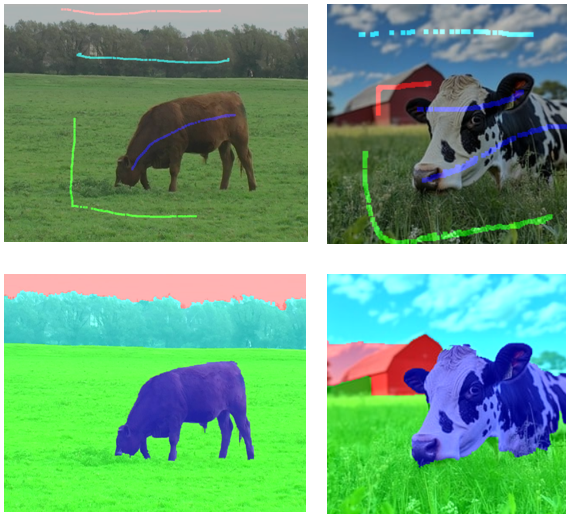
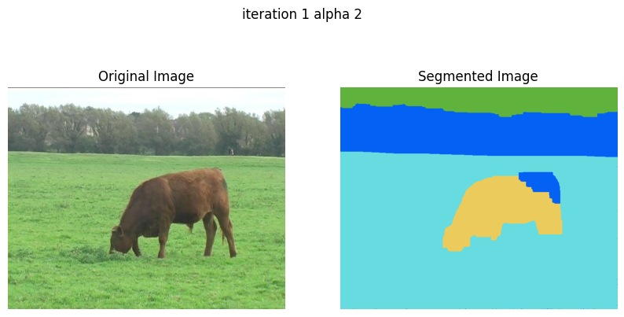

# 🔥 GraphCut Image Segmentation  

This repository contains implementations of **GraphCut-based image segmentation**, including **alpha-expansion**, **graph recycling**, and **interactive binary and multi-label segmentation techniques**. Our goal was to reproduce algorithms presented in the paper:  

> **Dynamic Hybrid Algorithms for MAP Inference in Discrete MRFs**  
> *Karteek Alahari, Pushmeet Kohli, and Philip H. S. Torr*  

This project was developed as part of the *Graphical Models* class at **CentraleSupélec/MVA 2025**.  
You can find our [report here](https://github.com/abatifol/graphCut_image_segmentation/blob/main/GRM_project_report.pdf)

**Authors**: *Pierrick Bournez, Antonine Batifol*  


## 🚀 Usage  

We provide **Jupyter notebooks** to demonstrate specific functionalities of our implementation. You can find them in the `notebooks/` folder.  

### Running the Notebooks  
1. Install the required dependencies:  
   ```bash
   pip install -r requirements.txt
   ```
2. Navigate to the `notebooks/` folder and experiment with:  
   - **Alpha-expansion**  
   - **Graph recycling**  
   - **Max-flow algorithms**  

3. To try **interactive image segmentation**, run the following scripts:  
   - **Binary segmentation:** graph_cut/brush_binarycut.py
   Use the mouse to first brush the foreground, then press 't' to toggle to background, brush the background and brush 'g' to run segmentation. You can press 'c' to clear the brushes or 't' to come back to adjust the brushes before rerunning segmentation.

   - **Multi-label segmentation:** graph_cut/brush_multicut.py
   Use the mouse to first brush the first label, then press 2 or 3 or K, to brush the other labels. Once it is done press 'g' to run segmentation. You can press 'c' to clear the brushes or 1 to K to readjust the brush.
   
   Don't forget to specify the number of labels for multicut, and change the image's path if you want.


## 📂 Repository Structure  

```
graphCut_image_segmentation/
│── dataset/                      
│   ├── dataset_example.ipynb    
│   ├── load_segmentation_dataset.py  
│
│── graph_cut/                     # Core implementation of GraphCut algorithms
│   ├── graphcut_reimplementation/ 
|       ├── graphcut.py             # Reimplementation of maxflow/mincut using Ford-Fulkerson Algorithm
│   ├── alpha_expansion.py          # Alpha-expansion implementation
│   ├── Alpha_recycling.py          # Alpha-recycling implementation
│   ├── base_algorithm.py          
│   ├── brush_binarycut.py          # Interactive binary segmentation
│   ├── brush_multicut.py           # Interactive multi-label segmentation
│   ├── display.py                  # Visualization utilities
│   ├── energy.py                   
│   ├── pairwise.py                 # Pairwise potential functions
│   ├── recycle.py                  # Graph recycling methods
│   ├── unary_cost.py               # Unary cost function definitions
│   ├── utils.py                    
│
│── images/                         # Sample images for segmentation
│── results/                        # Some segmentation results
│
│── notebooks/                      # Jupyter notebooks for testing and visualization
│   ├── Alpha_exp.ipynb             # Alpha-expansion demo (multi-label segmentation)
│   ├── recycle-step.ipynb          # Graph recycling combined with alpha-expansion
│   ├── test_our_graphcut_implementation.ipynb  # MaxFlow/MinCut reimplementation test
│
│── .gitignore                      
|── GRM_project_presentation.pdf     # Project presentation document
│── README.md                       
│── requirements.txt                 # Required dependencies
```


## ✨ Results 


**Interactive multi-label segmentation results**\
\


**Alpha Expansion results** 




## 📌 Installation  

Ensure you have Python installed, then install dependencies with:  

```bash
pip install -r requirements.txt
```
